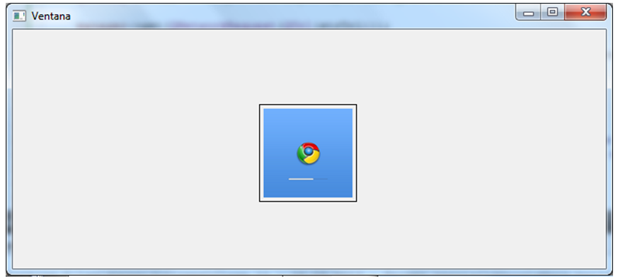

.. -*- coding: utf-8 -*-

.. _rcs_subversion:

Clase 14 - POO 2018
===================
(Fecha: 7 de mayo)
		
	
Funciones virtuales
^^^^^^^^^^^^^^^^^^^

- Puede ser interesante llamar a la función de la derivada (en polimorfismo).
- Al declarar una función como virtual en la clase base, si se superpone en la derivada, al invocar usando el puntero a la clase base, se ejecuta la versión de la derivada.

.. code-block:: c

	class Persona  {
	public:
	    Persona(QString nombre) : nombre(nombre)  {  }
	    virtual QString verNombre()  {  return "Persona: " + nombre;  }  // Y si no fuera virtual?

	protected:  
	    QString nombre;
	};

	class Empleado : public Persona  {
	public:
	    Empleado(QString nombre) : Persona(nombre)  {  }
	    QString verNombre()  {  return "Empleado: " + nombre;  }
	};

	#include <QApplication>
	#include "personal.h"
	#include <QDebug>

	int main(int argc, char** argv)  {
	    QApplication a(argc, argv);

	    {
	    Persona *carlos = new Empleado("Carlos");

	    qDebug() << carlos->verNombre();  // Qué publica?

	    delete carlos;
	    }

	    return a.exec();
	}

Función virtual pura y clase abstracta
^^^^^^^^^^^^^^^^^^^^^^^^^^^^^^^^^^^^^^

- No necesita ser definida, sólo se declara.
- Será definida en las clases derivadas

.. code-block:: c

	virtual void verValor(int a) = 0;

- Algunos pueden decir que no es muy elegante igualar a cero una función:

.. code-block:: c

	#define abstracta =0

	// entonces podemos usar:
	virtual void verValor(int a) abstracta;

- Una clase con al menos una función virtual pura la convierte en clase abstracta.
- Una clase abstracta no puede ser instanciada.
- Si en la clase derivada no se define la función virtual pura, significa que esta clase derivada también es abstracta.

.. code-block:: c

	#define abstracta =0

	class Persona  {
	public:
	    Persona(QString nombre) : nombre(nombre)  {  }
	    virtual QString verNombre() abstracta;

	protected:  
	    QString nombre;
	};

	class Empleado : public Persona  {
	public:
	    Empleado(QString nombre) : Persona(nombre)  {  }
	    QString verNombre()  {  return "Empleado: " + nombre;  }
	};

	int main(int argc, char** argv)  {
	    QApplication a(argc, argv);

	    {
	    Persona *carlos = new Empleado("Carlos");

	    qDebug() << carlos->verNombre();

	    delete carlos;
	    }

	    return a.exec();
	}

		
Ejercitación para primer parcial
^^^^^^^^^^^^^^^^^^^^^^^^^^^^^^^^

**Ejercicio** 

- Definir la siguiente jerarquía de clases:
 
.. figure:: images/clase10/clases.png 

- Se pedirá definición de atributos y métodos (en papel y sin utilizar material de consulta)
- Instanciar objetos de estas clases.
- Prestar atención sobre los punteros a objetos, ámbitos, parámetros en funciones, modificadores de acceso, ...

**Ejercicio:** Aritmética de punteros - Escribir la salida por consola

.. code-block:: c

	#include <QApplication>
	#include <QDebug>

	int main(int argc, char** argv)  {
	    QApplication app(argc, argv);

	    int a = 10, b = 10, c = 10, d = 10, e = 10;
	    int m[10] = {1, 2, 3, 4, 5, 6, 7, 8, 9, 10};
	    int *p = &m[2], *q = &m[4];

	    qDebug() << a + m[d/c] + b-- / *q + 10 + e--;
	    p = m;
	    qDebug() << e + *p + m[4]++;

	    return 0;
	}
	

**Ejercicio 9**

- Comenzar un proyecto vacío con QtCreator y diseñar el siguiente login de usuarios:
 
.. figure:: images/clase10/login.png  

- Este login tendrá las siguientes características:
	- Cuidar muy bien el layout. Notar la ubicación del botón con respecto a los campos.
	- Definido en la clase Login en los archivos login.h y login.cpp.
	- La ventana tendrá un tamaño de 250x120 píxeles y llevará por título "Login".
	- El único usuario válido es (DNI del alumno):(últimos 4 números del DNI)
	- Ocultar con asteriscos la clave.
	- Si el usuario y clave no es válido, sólo el campo de la clave se deberá limpiar.
	- Al fallar la clave 3 veces, la aplicación se cierra. 

- Si el usuario es válido, entonces se ocultará el login y se visualizará un nuevo QWidget como el que sigue:

 
- Este widget tendrá las siguientes características:
 	- Definido en la clase Ventana en los archivos ventana.h y ventana.cpp.
	- Con QNetworkAccessManager descargar una imagen cualquiera de 100x100 píxeles.
	- Esta imagen se mostrará en el QWidget centrada (como muestra el ejemplo).
	- Dibujar además un cuadrado que envuelva la imagen (como muestra el ejemplo).
	- La ventana puede tener cualquier tamaño y llevará por título "Ventana".

