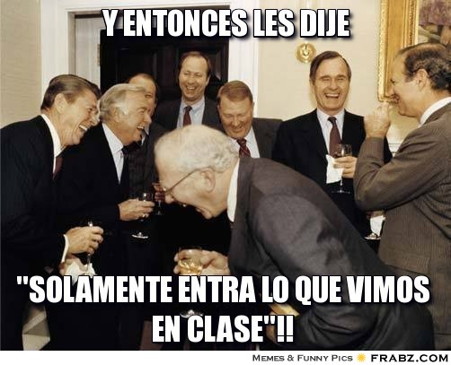

.. -*- coding: utf-8 -*-

.. _rcs_subversion:

Clase 16 - POO 2018
===================
(Fecha: 14 de mayo)

Uso de Qt Designer
..................

- Nuevo proyecto -> Qt GUI Application
- Utilizar el puntero ``ui`` para acceder a los objetos del diseño
- Tener en cuenta que los métodos virtuales de QWidget para eventos se pueden usar:

.. code-block:: c	

	virtual void mousePressEvent(QMouseEvent* event);
	virtual void resizeEvent(QResizeEvent* event);
	virtual void moveEvent(QMoveEvent* event);
	...

**Ejemplo**

.. code-block:: c	
	
	// ventana.h
	#ifndef VENTANA_H
	#define VENTANA_H

	#include <QWidget>

	namespace Ui {
	    class Ventana;
	}

	class Ventana : public QWidget  {
	    Q_OBJECT

	public:
	    explicit Ventana(QWidget *parent = 0);
	    ~Ventana();

	private:
	    Ui::Ventana *ui;
	};

	#endif // VENTANA_H

.. code-block:: c

	// ventana.cpp
	#include "ventana.h"
	#include "ui_ventana.h"

	Ventana::Ventana(QWidget *parent) : QWidget(parent), ui(new Ui::Ventana)  {
	    ui->setupUi(this);
	}

	Ventana::~Ventana()  {
	    delete ui;
	}

Un par de memes antes del examen
^^^^^^^^^^^^^^^^^^^^^^^^^^^^^^^^

.. figure:: images/clase10/meme4.jpg

