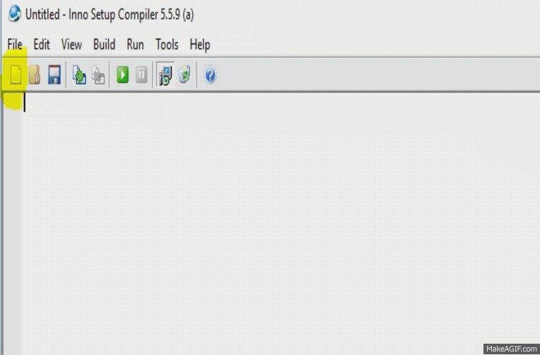

.. -*- coding: utf-8 -*-

.. _rcs_subversion:

Clase 19 - POO 2018 (No preparado aún)
===================
(Fecha: 22 de mayo)

Creando Instalador
^^^^^^^^^^^^^^^^^^

**Mexican explanation**

|ImageLink|_ 

.. |ImageLink| image:: /images/clase14/mexicano.gif
.. _ImageLink: https://www.youtube.com/watch?v=rr6G7GU52Wc

**Capturas de pantalla de la creación**

**Ejercicio 16**

- Diseñar una aplicación que muestre en un ``QWidget`` cualquier imagen de 50x50
- La imagen deberá seguir al puntero del mouse cuando esté presionado un botón.
- Utilizar ``QTimer`` para actualizar la posición de la imagen dando un efecto inercial

Ejecutable del ejercicio de arrastrar y soltar la imagen
........................................................

- `Descargar Instalador de MouseMove (Windows 7 o superior - 64 bits) <https://drive.google.com/file/d/0B3bNJFNPgLHnc3ota21TVVBKb0k/view?usp=sharing>`_

- `Descargar MouseMove (Linux - 64 bits) <https://drive.google.com/file/d/0B3bNJFNPgLHnMGtzWjlQa3RIc1E/view?usp=sharing>`_

